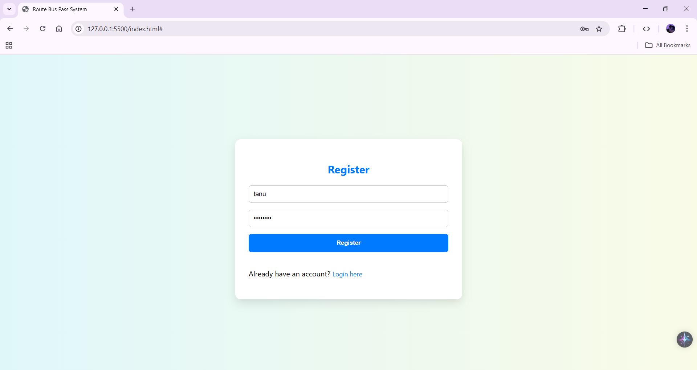
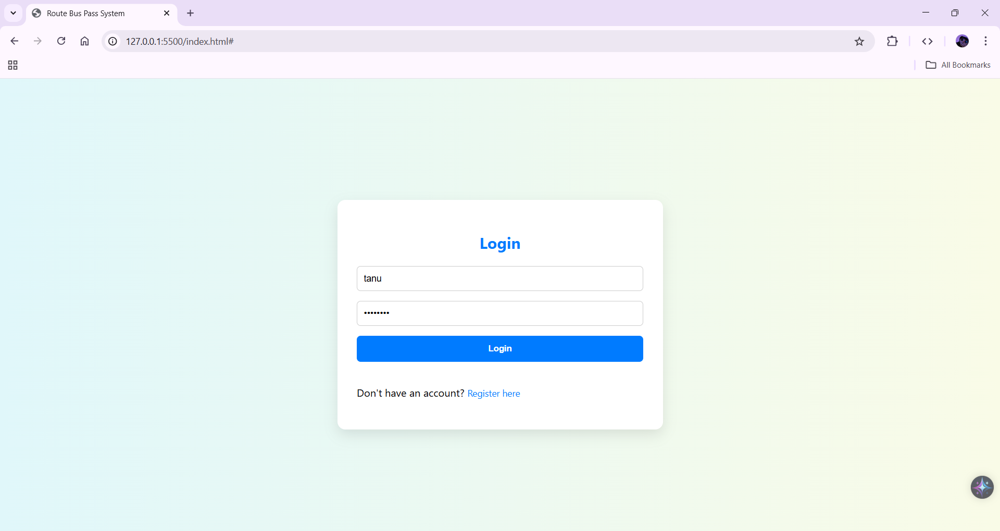
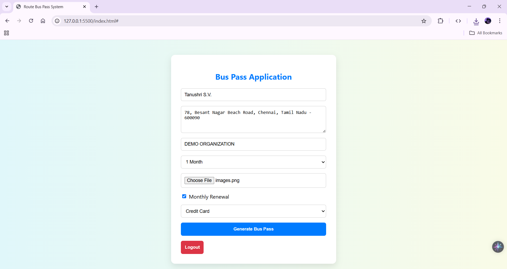
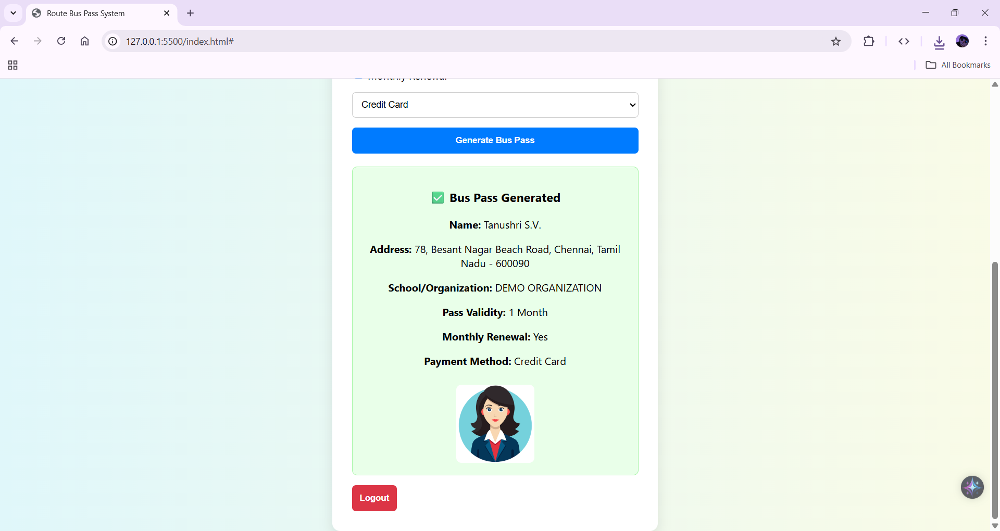
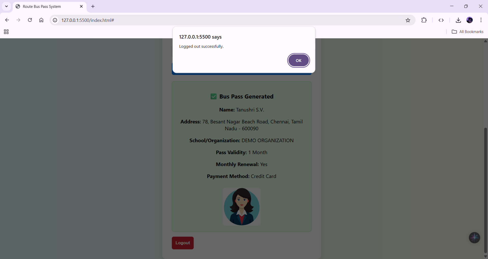

# Route Bus Pass System

A **Route Bus Pass System** built using **HTML, CSS, and JavaScript**, allowing users to register, log in, apply for bus passes, and generate passes with uploaded photo details.

---

## 🚀 Features
- User registration and login system  
- Apply for bus passes with personal and organization details  
- Upload user photo for bus pass  
- View generated bus pass  
- Logout functionality  
- Responsive and user-friendly interface  

---

## 🛠️ Technologies Used
- **Frontend:** HTML, CSS, JavaScript  
- **Version Control:** Git & GitHub  

---

## 📸 Screenshots

### 1. Registration Page

### 2. Login Page

### 3. Bus Pass Application

### 4. Generated Bus Pass

### 5. Logout

---

🔗 **Live Demo**

[View Live Project](https://tanushrisv.github.io/bus_pass_system/)  

© 2025 Tanushri S V. All rights reserved.
